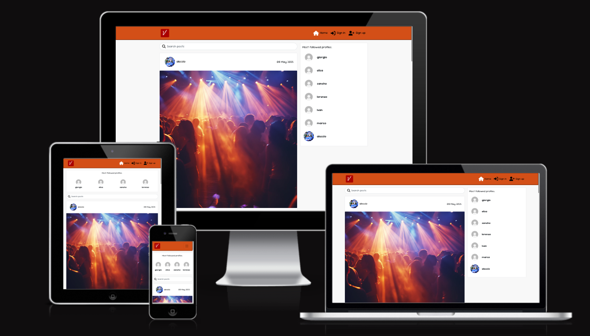

# Vibook - React

## Project description

Vibook is a social media platform. It has been designed for its users to share parties and venues. The application consists of the React app and an API. Welcome to the React front end project section.

[View live website here](https://vibook-557c0bb75197.herokuapp.com/)

## Table of Contents

- [Project](<#project>)
    * [Objective](<#objective>)
    * [Site Users Goal](<#site-users-goal>)
    * [Site Owners Goal](<#site-owners-goal>)
    * [Project Management](<#project-management>)

- [User Experience (UX)](<#user-experience-ux>)
    * [Wireframes](<#wireframes>)
    * [User Stories](<#user-stories>)
    * [Site Structure](<#site-structure>)
    * [Design Choices](<#design-choices>)

- [Existing Features](#features)
  * [Navigation](#navigation)
  * [Authentication](#authentication)
  * [Homepage](#homepage)
  * [Feed](#feed)
  * [My Events](#my-events)
  * [Create an Event](#create-an-event)
  * [Event Detail Page](#event-detail-page)
  * [Reviews](#reviews)
  * [Profile Page](#profile-page)
  * [Contact](#contact)
  * [Reusable React Components](#reusable-react-components)

- [Features Left To Implement](<#features-left-to-implement>)

- [Technologies Used](<#technologies-used>)
    * [Languages](<#languages>)
    * [Frameworks & Software](<#frameworks--software>)
    * [Libraries](<#libraries>)
- [Agile Workflow](#agile-workflow)
  * [Github Project Board](#github-project-board)
- [Testing](#testing)
- [Deployment](#deployment)
- [Credits](#credits)

# **Project**

## Objective

The objective of this project is to build a content sharing web application for users to share pictures from parties they attend and party venues they visit, as hosts share upcoming event and details about venues. The platform allows users to view, create, edit, delete, and comment posts. The content can be viewed in a logical order,  filtered by category, and searched on by keywords. Users can also follow each other and register their interest in other user's shared content. 

## Site User's Goal

There are primarily two types of users who will be interacting with this platform. Users who host events in the local area, and users who attend events in the local area.

The event hosts can to share the details of upcoming events in the venue's posts, so that other users are informed about the events and the venue hosting them. They can also read people's comments regarding the event, and receive messages from interested users who have questions, by updating the venue's profile with contacts.
Other users on the other hand, can check out parties and other users who attend parties in a specific venue, so that they might want to attend the next event hosted, and get to know more clubs and party venues.

## Site Owner's Goal

As the site owner, i thought it would be a good idea to have a platform where users can share pictures of places and parties for other users who could be interested on know or find out about this kind of events and venues, and for hosts to publicise their clubs.

## Project Management

### Github Project Board

I've been using the kanban board in GitHub to keep track of all the features needed to implement for the front end application, according to the user stories.

* [Project Board](https://github.com/users/alelodato/projects/6/views/1).

* [User Stories](https://github.com/alelodato/vibook/issues?q=is%3Aissue%20state%3Aclosed)

## User stories

| Category  | as      | I want to                      | so that I can                                                                                    | UI components                                |
| --------- | ------- | ------------------------------ | ------------------------------------------------------------------------------------------------ | -------------------------------------------- |
| auth      | user    | register for an account        | have a personal profile with a picture                                                           | SignUpForm ProfilePage ProfileEditForm |
| auth      | user    | register for an account        | create, like and comment on posts                                                                | Post PostPage Comment                  |
| auth      | user    | register for an account        | follow users                                                                                     | Profile ProfilePage                       |
| posts     | visitor | view a list of posts           | browse the most recent uploads                                                                   | PostsPage                                    |
| posts     | visitor | view an individual post        | see user feedback, i.e. likes and read comments                                                  | Post PostPaget                            |
| posts     | visitor | search a list of posts         | find a post by a specific artist or a title                                                      | PostsPage                                    |
| posts     | visitor | scroll through a list of posts | browse the site more comfortably                                                                 | InfiniteScrollComponent                      |
| posts     | user    | edit and delete my post        | correct or hide any mistakes                                                                     | PostEditForm MoreDropdownMenu             |
| posts     | user    | create a post                  | share my moments with others                                                                     | PostCreateForm                               |
| posts     | user    | view liked posts               | go back often to my favourite posts                                                              | PostsPage                                    |
| posts     | user    | view followed users' posts     | keep up with my favourite users' moments                                                         | PostsPage                                    |
| likes     | user    | like a post                    | express my interest in someone's shared moment                                                   | Post like icon                               |
| likes     | user    | unlike a post                  | express that my interest in someone's shared moment has faded away                               | Post (un) like icon                          |
| comments  | user    | create a comment               | share my thoughts on other people's content                                                      | PostPage CommentCreateForm                |
| comments  | user    | edit and delete my comment     | correct or hide any mistakes                                                                     | PostPage Comment MoreDropdownMenu      |
| profiles  | user    | view a profile                 | see a user's recent posts + post, followers, following count data                                | ProfilePage Post                          |
| profiles  | user    | edit a profile                 | update my profile information                                                                    | ProfileEditForm                              |
| followers | user    | follow a profile               | express my interest in someone's content                                                         | Profile follow button                        |
| followers | user    | unfollow a profile             | express that my interest in someone's content has faded away and remove their posts from my feed | Profile (un) follow button                   |

### Database Schema

All the models have been set up in a separate DRF repository. Click [here](https://github.com/quiltingcode/events-backend-api) to view the repository or [here](https://happening-api-kelz.herokuapp.com/) to view the deployed API.

 
[Back to top](<#table-of-contents>)

# **User Experience (UX)**

## Wireframes

The wireframes for the site were created in the software [Balsamiq](https://balsamiq.com). The wireframes have been created principally for desktop devices as this is a browser based platform. However, the wesbite is responsive for tablet and mobile, and I have created additional wireframes to show how the various events pages and profile page adapt to smaller devices. The main grid layout of the components is initially based on the CI Moments walkthrough tutorial as this seems to me the best layout both for wider desktops as for smaller mobile devices for a content sharing platform so I didn't see much reason to change it or find many areas where I could improve on it. Any differences are down to personalised content that fits the project goals.

<b>Wireframes</b>

 

## Detailed page and component breakdown:

## Most reused components:

- PostsPage:
  - Home, Feed, Liked
- Post:
  - PostsPage
- Profile:
  - PopularProfiles, PopularProfiles (mobile)
- DropdownMenus:
  - Post, ProfilePage, Comment
- InfiniteScrollComponent:
  - PostPage (loading Comment components)
  - PostsPage (loading all, feed or liked Post components)
  - ProfilePage (loading Post components that belong to the profile)

## Deployment steps

- add prebuild script
- add Procfile
- remove all console.logs
- use Bootstrap default imports to minimize the build
- deploy to Heroku

## Tests:

### Automated:

- used the msw library to mock user and logout endpoints
- tested the NavBar component:
  - renders without a problem
  - renders the link to a user profile for a logged in user
  - renders the sign in and sign up buttons again on logout

### Manual:

- every other feature tested extensively

## Libraries, contexts and hooks:

- react-infinite-scroll-component
  - introduced to replace traditional pagination with lazy loading instead of pagination to make the application more performant and seem more snappy/ engaging
- react-bootstrap:
  - introduced
- contexts:
  - CurrentUserContext exposes the user state to the entire app. Relevant components can subscribe to its changes
  - ProfileDataContext exposes the profile state to the entire app. Enables the PopularProfiles component to be in sync with the ProfilePage contents
- custom hooks written to reduce repeatable state logic:
  - useClickOutsideToggle: enable toggle on the burger menu
  - useRedirect: enable redirect for users who are either logged in or logged out, depending on the use case

---
