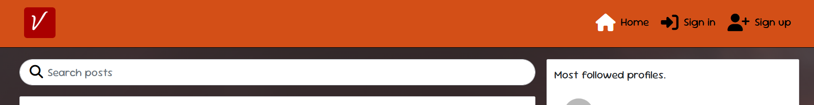

# Vibook - React

## Project description

Vibook is a social media platform. It has been designed for its users to share parties and venues. The application consists of the React app and an API. Welcome to the React front end project section.

[View live website here](https://vibook-557c0bb75197.herokuapp.com/)

## Table of Contents

- [Project](<#project>)
    * [Objective](<#objective>)
    * [Site Users Goal](<#site-users-goal>)
    * [Site Owners Goal](<#site-owners-goal>)
    * [Project Management](<#project-management>)

- [User Experience (UX)](<#user-experience-ux>)
    * [Wireframes](<#wireframes>)
    * [User Stories](<#user-stories>)
    * [Site Structure](<#site-structure>)
    * [Design Choices](<#design-choices>)

- [Existing Features](#features)
  * [Navigation](#navigation)
  * [Authentication](#authentication)
  * [Homepage](#homepage)
  * [Feed](#feed)
  * [My Events](#my-events)
  * [Create an Event](#create-an-event)
  * [Event Detail Page](#event-detail-page)
  * [Reviews](#reviews)
  * [Profile Page](#profile-page)
  * [Contact](#contact)
  * [Reusable React Components](#reusable-react-components)

- [Features Left To Implement](<#features-left-to-implement>)

- [Technologies Used](<#technologies-used>)
    * [Languages](<#languages>)
    * [Frameworks & Software](<#frameworks--software>)
    * [Libraries](<#libraries>)
- [Agile Workflow](#agile-workflow)
  * [Github Project Board](#github-project-board)
- [Testing](#testing)
- [Deployment](#deployment)
- [Credits](#credits)

# **Project**

## Objective

The objective of this project is to build a content sharing web application for users to share pictures from parties they attend and party venues they visit, as hosts share upcoming event and details about venues. The platform allows users to view, create, edit, delete, and comment posts. The content can be viewed in a logical order,  filtered by category, and searched on by keywords. Users can also follow each other and register their interest in other user's shared content. 

## Site User's Goal

There are primarily two types of users who will be interacting with this platform. Users who host events in the local area, and users who attend events in the local area.

The event hosts can to share the details of upcoming events in the venue's posts, so that other users are informed about the events and the venue hosting them. They can also read people's comments regarding the event, and receive messages from interested users who have questions, by updating the venue's profile with contacts.
Other users on the other hand, can check out parties and other users who attend parties in a specific venue, so that they might want to attend the next event hosted, and get to know more clubs and party venues.

## Site Owner's Goal

As the site owner, i thought it would be a good idea to have a platform where users can share pictures of places and parties for other users who could be interested on know or find out about this kind of events and venues, and for hosts to publicise their clubs.

## Project Management

### Github Project Board

I've been using the kanban board in GitHub to keep track of all the features needed to implement for the front end application, according to the user stories.

* [Project Board](https://github.com/users/alelodato/projects/6/views/1).

* [User Stories](https://github.com/alelodato/vibook/issues?q=is%3Aissue%20state%3Aclosed)

## User stories

| Category  | as      | I want to                      | so that I can                                                                                    | UI components                                |
| --------- | ------- | ------------------------------ | ------------------------------------------------------------------------------------------------ | -------------------------------------------- |
| auth      | user    | register for an account        | have a personal profile with a picture                                                           | SignUpForm ProfilePage ProfileEditForm |
| auth      | user    | register for an account        | create, like and comment on posts                                                                | Post PostPage Comment                  |
| auth      | user    | register for an account        | follow users                                                                                     | Profile ProfilePage                       |
| posts     | visitor | view a list of posts           | browse the most recent uploads                                                                   | PostsPage                                    |
| posts     | visitor | view an individual post        | see user feedback, i.e. likes and read comments                                                  | Post PostPaget                            |
| posts     | visitor | search a list of posts         | find a post by a specific venue or a title                                                      | PostsPage                                    |
| posts     | visitor | scroll through a list of posts | browse the site more comfortably                                                                 | InfiniteScrollComponent                      |
| posts     | user    | edit and delete my post        | correct or hide any mistakes                                                                     | PostEditForm MoreDropdownMenu             |
| posts     | user    | create a post                  | share my content with others                                                                     | PostCreateForm                               |
| posts     | user    | view liked posts               | go back often to my favourite posts                                                              | PostsPage                                    |
| posts     | user    | view followed users' posts     | keep up with my favourite users' content                                                        | PostsPage                                    |
| likes     | user    | like a post                    | express my interest in someone's shared content                                                   | Post like icon                               |
| likes     | user    | unlike a post                  | express that my interest in someone's shared content has faded away                               | Post (un) like icon                          |
| comments  | user    | create a comment               | share my thoughts on other people's content                                                      | PostPage CommentCreateForm                |
| comments  | user    | edit and delete my comment     | correct or hide any mistakes                                                                     | PostPage Comment MoreDropdownMenu      |
| profiles  | user    | view a profile                 | see a user's recent posts + post, followers, following count data                                | ProfilePage Post                          |
| profiles  | user    | edit a profile                 | update my profile information                                                                    | ProfileEditForm                              |
| followers | user    | follow a profile               | express my interest in someone's content                                                         | Profile follow button                        |
| followers | user    | unfollow a profile             | express that my interest in someone's content has faded away and remove their posts from my feed | Profile (un) follow button                   |

### Database Schema

All the models have been set up in a separate DRF repository. Click [here](https://github.com/alelodato/vibook-api) to view the repository or [here](https://vibook-api-259e45270715.herokuapp.com/) to view the deployed API.

 
[Back to top](<#table-of-contents>)

# **User Experience (UX)**

## Wireframes

The wireframes for the site were created by hand when i was designing the project. The wireframes have been created for desktop and smaller devices as tablets or mobiles. The website layout of the components based on the CI Moments walkthrough tutorial as this seems to me the best layout both for wider desktops as for smaller mobile devices for a content sharing platform so I didn't see much reason to change it or find many areas where I could improve on it.

<b>Wireframes</b>

 

## Detailed page and component breakdown:

The application has the same components as the CI Moment walkthrough project so i used the component breakdown table related to it: 

## Site Structure

Vibook structure is split up in two parts: when the user is logged out and when the user is logged in. Depending on login status different pages are available for the user. When the user is logged out the pages: Home, and Sign In or Up are available from the Navigation Bar menu. When the user is logged in Feed, Signout and Profile Page also become available.

## Design Choices

* ### Color Scheme

When deciding on the colour scheme for my site, I looked at other content sharing platforms such as Facebook, Instagram and Eventbrite for inspiration. All of these use a very neutral color scheme with barely any background colour at all, and then just hints of brand color here and there to let the buttons stand out. In order to follow a similar approach, I chose a very neutral background color and then complimentary orange and black tones for the icons and buttons. 

* ### Typography

The main font used for the site is 'Sour Gummy' Sans-Serif. This font is nice and clear to read even though the platform in general is not text-heavy. 

[Sour Gummy Font](https://fonts.google.com/specimen/Sour+Gummy?categoryFilters=Feeling:%2FExpressive%2FHappy)

[Back to top](<#table-of-contents>)

# **Existing Features**

* ## Navigation

The navigation bar is very clean and straight forward. Depending on whether you are logged in or not, different menus are visible for the site user. For tablet and mobile devices, the navigation bar menu turns into a burger dropdown list. 

On accessing the site for the first time, the user is logged out and the following menu items are visible:

* Vibook Logo - On the far left hand side of the navigatin bar is the Vibook brand logo. This is visible throughout the site to all user types and contains a link back to the homepage. The logo is very minimal, just showing a "V" on a red background, and it was made on the [Favicon](https://favicon.io/) website.

* Home - the first menu item, and the initial default start page, is 'Home', where all posts shared among the community are displayed. 

* Authentication - Two icons next to the homepage one, where the user has the options to Signin or Signup which takes them to the respective page. 

Once the user logs in, additional links become available to select:

* Feed - Logged in users can access the feed page where they can see posts of other profiles they follow.

* Authentication - The icons within the authentication change once a user has logged in, and now display a link to the user's own profile page or a link to sign out of the site.

* Add Post - Logged in users can access the post creation page to share their own content to the site. 

## Authentication

Users who are new to the site, or haven't previously created an account can click on the Signup Menu option on the Navigation Bar to create a user account.  I have used the standard dj-rest/auth/registration user account signup process for this. 

If a user has a Vibook user account, they can click on the Signin menu option in the Navigation Bar to sign into their account.

If the user wishes to sign out, once signed in, the sign out option becomes visible in the Navigation Bar for them to select. 

* ## Homepage

There are four main react components which make up the Home events page. 

1. Popular Profiles Component
2. Events posts
3. Top Upcoming Events
4. Search and Filter

### Popular Profiles Component

The popular profiles component is a permanent feature across the entire site. It appears at the top of all pages. This component uses a filter to order all site users by followers count from highest to lowest. The users with the highest follower count are determined to be the most popular profiles and the top six are displayed within the popular profiles component. 

If the user isn't logged in, they can see avatar, and the username of the top 6 most popular profiles, and if the user is logged in, they will also see a button enabling them to follow or unfollow the profile. 

If the follow button is greyed out, it is because your own profile has made it to the top 6 most popular profiles list, but you are not allowed to follow yourself. Originally, it was simply the case that no button appeared under your own profile but aesthetically, this didn't look good and the component didn't look balanced, so I decided to put an inactive button with a tooltip there instead. 

Each profile avatar can be clicked on to view the full profile page of that user. 

### Events Posts

All events that are created through the Happening sharing platform are displayed on the Homepage. All events created are requested from the API and they are ordered by the created date starting with the most recently posted and working backwards. 

Each event posting displays the user who shared it and the date it was shared. The event poster is in the center, and underneath are the event details. In bold, you can see the event title and the date it's going to take place. Next is a description of the event, and the tags.

Each event has three counts shown - A count of people interested in the event, a count of people planning on going to the event, and a count of comments users have posted about this event. 

The first two counts work on a toggle system but in addition to this, they are also mutually exclusive. You can click the interested button on and off to make the count go up and down. Equally, you can click the going button on and off to make the count go up and down. However, if you have previoulsy clicked interested, and now you've decided to attend the event, by clicking the going button, the interested count automatically goes down by 1 as the going count goes up by 1. And vice versa. You can't be both interested and going to an event. It must be one or the other. 

By clicking on the event image or the comments count, the user is taken to the event details page.

### Top Upcoming Events

The third component of the events page is the Top Upcoming Events component. In desktop view, this is shown next to the popular profiles and events, and on tablet and mobile devices, this component moves over into the center and is displayed between the popular profiles and the events. 

This component uses two filters: The first filter comes from the API and orders all site events by going count from highest to lowest. Next, I used a Javascript filter on the frontend results to check the event date, and filter out any events where the event_date field is in the past. There is no point continually promoting fantastic events which have already taken place. Finally, on smaller devices I've taken just the top five results so that it fits better on smaller screens. 

If you click on any of the top events listed, you are taken to the event details page.

### Search and Filter

If the user wants to search for specific events or an event, they have two ways to achieve this:

1. All events are assigned a category on creation, and so the events list can be filtered by these categories to show only the events in one category selected by the user from the dropdown options. 

2. Search - The user can search all the events listed by event title, username who posted it, event date, or event tags. This search can be used in conjunction with the category filter or independently, but when the site has a lot of shared events, using both search and filter together makes the overall search facility much more efficient. 

* ## Feed

The feed page looks identical to the homepage, only the Events Posts component changes. In this page all the events are requested from the API, but then a filter is used to only show events posted by profiles that the currently logged in user is following. For this reason, this page doesn't work if the user is not logged in. Equally, if the user isn't following any other profiles, no events will be displayed and a 'No Results found' message will appear instead inside the events posts component. 

* ## My Events

The My Events page looks identical to the homepage, only the Events Posts component changes. On selecting the My Events menu option in the NavBar, you are shown a dropdown with two additional options. Interested or Going. If you select interested, the events posts component will be filtered to only show the events where the logged in user has clicked the interested button. Alternatively, if the user selects the going option from navbar dropdown, the filter changes to only show events where the logged in user has clicked the going button. 

In the original plan for this project, I wanted the My Events page to be a combination of all the events where the user has selected either interested or going on an event. Initially, I tried to set up the backend API and display both these filters at the same time, but I couldn't join the two filterset fields together. I asked among the slack community and others had achieved adding two filters together with an AND command, but nobody seemed to know how to do an OR command. I consulted my mentor further into the project when I had the frontend up and running and he was also unsure how this could be achieved and suggested I just add an additional filter dropdown to toggle between the two for now. 

* ## Create an Event

If you are logged in, you are able to share new events with the community. By clicking on the Add Event menu option in the Navigation Bar, you are taken to the Share a New Event page, where you can submit the event creation form to the API.

All fields are mandatory apart from the event description (which may be understood from the event poster image that is uploaded) and an image must be uploaded for the event to be submitted successfully. Once the form has been submitted successfully, you can see the event published successfully as you are re-directed automatically to the newly created event details page. 

Each time you share a new event with the community, your events count goes up on your profile page for other users to see how active you are as an event host. 

* ## Event Detail Page

In the event details page, this simply shows everything relating to one single event. You can reach this page by clicking on an event image in any of the events pages or on the event title in the Top Upcoming Events component and Reviews page. It also shows the popular profiles component and the Top Upcoming Events component for continuity across the pages. If you are the owner of the event, from this page you have the option to edit or delete the event by clicking on the three dots that appear next to the event posted date. 

If you select Edit, you are taken back to the event creation form, but the fields are already pre-populated with the existing event information. You can edit the desired fields and save the changes, which will return you to the event detail page and you can see that the event has been updated successfully. 

If you select Delete, a pop-up message appears asking you if you are sure you want to delete this event. This defensive design component allows the user to cancel out of the deletion process if the button was pressed in error. If however, the user wishes to proceed with the deletion they can click confirm and the event will be removed from all pages and the user redirected back to the previously visited page. 

Below the event details is the comments section. If there are no comments yet, the user will see a message telling them that there are no comments. 

If the user is not logged in, they can read any comments that have been posted but they can't post a comment themselves unless they log in. 

Any comments that have been posted about this event are displayed, regardless of login status. If the user logs in they will see a comment form above the existing comments where they can post their own comments about the event for other users to read. 

* ## Profile Page

Throughout the site, wherever you see profile avatars, albeit in the popular profiles component, or next to events, comments or reviews that have been published, you can click on the avatar to view the full profile page of that user. In the Navigation Bar, in the authentication dropdown, you can access your own profile page as well.  

### Profile Stats

When a user signs up and creates a new site account, a basic profile is automatically created with a username, password and defauly avatar image. The only information that subsequently gets updated in the profile page is the site usage stats, as follows: 

* Number of events the user has posted
* Number of events the user has flagged as going
* Number of profiles they are following
* Number of profiles that are following them

There is an about container and a contact details container which remain empty until the user goes into their own profile page and clicks on the three dots dropdown to Edit the profile and add their personal details to the page. If they click on the Edit Profile option, they are taken to a new page containing the full profile details form to fill in and submit. Here, they can add their own avatar image, a name, bio, website address, instagram or facebook link, a telephone number and an email address. These are designed mainly to give event hosts the opportunity to publish additional contact information and social media links but of course all users are welcome to add as much or little personal info as they wish. 

Once these fields have been filled in, they can be seen by other users in the main profile page stats container. Any website links that are entered can be clicked on to open the website in a new browser tab. 

Each profile also has a follow button inside the stats container so that other users can click it to follow and unfollow the profile as all profiles won't always appear listed in the popular profiles component, to access the follow functionality there. 

### Profile Posts

Below the profile stats you can see all the events posted by the profile you are viewing. Any of these can be clicked on to view the individual event detail page with comments if there are any. 

* ## Contact

At the top of the profile page, the user can still see the popular profiles component as a permanent feature across the site, but the top upcoming events component has been replaced by a messaging system component. On desktop devices the message component is visible on the right of popular profiles, but for tablet and mobile it moves into place between the popular profiles and the User Profile Stats. 

If you are viewing someone else's profile, the message component contains a form to write a message and send it to the owner of the profile page you are viewing. 

If you are viewing your own profile page the messaging component will display your own private message inbox. Other users will not be able to see the messages that have not been sent to them. All messages that have been sent to you, are displayed in descending order of when they were sent. You can see the avatar and the username of the sender, the date the message was sent, and the message itself. Each message has a 'reply' button if the user wants to send a reply message back to the sender. 

Unlike with other forms such as creating an event, comment or review, where you can see the published content once the form has been posted successfully, the user does not have access to other user's inboxes to check whether the message has been sent successfully or not. For this reason, in the case of the messaging component, I have set up an alert system using Bootstrap alerts, to display a success alert message when a message or a reply message have been sent successfully. This adds to good user experience, and user peace of mind. 

Equally, if the user tries to send a blank message, they will see a Bootstrap warning message telling them that they must fill in the message field in order to send the message successfully. 

For the time being, there is no alert system in place to send a notification to a user when they receive a new message, but this is something I would like to look into in future development sprints.
* ## Reusable React Components

### Three Dots Edit Delete Dropdown Menu

Based on the Moments walkthrough project 'MoreDropdown' component, I have utilised the same idea in my project but extended it's use even further to be accessed when editing or deleting events, comments and also reviews. In addition to this re-usable component which I learnt from the course tutorials, I also developed four more custom re-usable components specifically for my project.

### Delete Confirmation Component

In order to improve defensive design, I wanted to add a validation check before data gets deleted from the site. For this reason, I have developed a modal pop-up component which double checks whether the user wants to continue with their choice, after having clicked the delete button from the EditDeleteDropdown component on an event, a comment or a review. This component checks what type of data the user is trying to delete, and customises the modal message appropriately. On clicking the 'Confirm Deletion' button the corresponding handleDelete function is called, and the data is removed from the site

### Date Formatter Component

Originally, I tried to format the event event_date field on the backend, but it caused all sorts of error messages and I couldn't quite get it to work correctly. Having consulted tutor support, they told me that it was also possible to leave the date format on the backend and just format it where necessary on the frontend. There are three areas in this site where event_date is published; in the event posting, in the top upcoming events component, and in the review listings. 

When I tried requesting the event_date from the API in a formatted form, it came through OK, similar to how the created_at date is formatted in the backend, but then when it came to pre-populating it back into an edit form, it wouldn't go back correctly into the date field. I therefore decided to leave the date format for all the API requests in it's original format, and just created a re-usable function - 'DateFormatter.js' to make it appear nicely for the front end user to view. 

### Alert Component

As stated previously, there is no way for the user to check whether the message form has been submitted correctly or not, as the user doesn't have access to other user's inbox. I therefore wanted to set up a bootstrap success alert. Initially I created this as a single function inside the MessageCreateForm.js component. In a later sprint, when I was developing the reply feature, I decided to create a re-usable Alert component which could be used interchangeably between the send message and reply message forms. I refactored the code inside the MessageCreateForm component and imported the newly created AlertMessage component into the ReplyMessageForm.js component as well. In future development, I can extend this functionality to show user alerts in more areas of the site. 

### Scroll to Top Component

With the infinite scroll functionality in place, once there are a lot of events posted to the site, and the user scrolls a long way down looking at posts, once they want to return to the navbar options, it takes a long time to manually scroll all the way back up again, harming user experience.  For this reason, I have implemented a button which appears once the user has scrolled down more than 1000px ( appears after viewing the first post) and remains fixed to the bottom of the screen for when the user wants to return to the navbar menu at the top. 

Initially I implemented a simple button at the bottom of the events pages screen which takes the user back to the top of the window. However, in this scenario the user has to scroll through all events to reach the button. Looking at an article from [W3Schools](https://www.w3schools.com/howto/howto_js_scroll_to_top.asp) I added CSS to fix the button to the bottom of the page, and a function to keep the button hidden until the user has scrolled down more than 1000px. I moved this function into a re-usable hook component, which I then imported into the Profile Page and the Reviews page as well. 

[Back to top](<#table-of-contents>)

## Tests:

### Automated:

- used the msw library to mock user and logout endpoints
- tested the NavBar component:
  - renders without a problem
  - renders the link to a user profile for a logged in user
  - renders the sign in and sign up buttons again on logout

### Manual:

- every other feature tested extensively

## Libraries, contexts and hooks:

- react-infinite-scroll-component
  - introduced to replace traditional pagination with lazy loading instead of pagination to make the application more performant and seem more snappy/ engaging
- react-bootstrap:
  - introduced
- contexts:
  - CurrentUserContext exposes the user state to the entire app. Relevant components can subscribe to its changes
  - ProfileDataContext exposes the profile state to the entire app. Enables the PopularProfiles component to be in sync with the ProfilePage contents
- custom hooks written to reduce repeatable state logic:
  - useClickOutsideToggle: enable toggle on the burger menu
  - useRedirect: enable redirect for users who are either logged in or logged out, depending on the use case

  # **Technologies Used - Frontend**

## Languages

* [HTML5](https://en.wikipedia.org/wiki/HTML) - Provides the content and structure for the website.
* [CSS3](https://en.wikipedia.org/wiki/CSS) - Provides the styling for the website.
* [JavaScript](https://en.wikipedia.org/wiki/JavaScript) - Provides interactive elements of the website
* [React.js](https://en.wikipedia.org/wiki/React_(software)) - Provides the base for the frontend components

## Frameworks & Software
* [React Bootstrap](https://react-bootstrap.github.io/) - A CSS framework that helps build solid, responsive, mobile-first sites
* [Balsamiq](https://balsamiq.com/) - Used to create the wireframes
* [Github](https://github.com/) - Used to host the repository, store the commit history and manage the project board containing user stories and bug reports.
* [Heroku](https://en.wikipedia.org/wiki/Heroku) - A cloud platform that the application is deployed to.
* [Lighthouse](https://developer.chrome.com/docs/lighthouse/overview/) - Used to test site performance.
* [Responsive Design Checker](https://www.responsivedesignchecker.com/) - Used for responsiveness check across devices.
* [Favicon](https://favicon.io/) - Used to create the favicon.
* [Google Chrome DevTools](https://developer.chrome.com/docs/devtools/) - Used to debug and test responsiveness.
* [Cloudinary](https://cloudinary.com/) - A service that hosts image files in the project.
* [My Free Logo Maker](https://myfreelogomaker.com/explore) - Used to create the Happening brand logo
* [ColorSpace](https://mycolor.space/?hex=%23081045&sub=1) - Used to create the colour palette
* [HTML Validation](https://validator.w3.org/) - Used to validate HTML code
* [CSS Validation](https://jigsaw.w3.org/css-validator/) - Used to validate CSS code
* [JSHint Validation](https://jshint.com/) - Used to validate JavaScript code

## Libraries

* [NPM React-star-rating](https://www.npmjs.com/package/react-simple-star-rating) - A simple react component for adding a star rating to your project.

[Back to top](<#table-of-contents>)

# **Happening**

# Frontend Testing

## Table of Contents

* [**Testing**](<#testing>)
    * [Code Validation](<#code-validation>)
    * [Automatic Testing](<#automatic-testing>)
    * [Manual Testing](<#manual-testing>)
    * [Responsiveness Testing](<#responsiveness-testing>)
    * [Lighthouse Testing](<#lighthouse-testing>)
    * [Known Bugs](<#known-bugs>)

## Code Validation 

The Happening site has been passed through the [W3C html Validator](https://validator.w3.org/), the [W3C CSS Validator](https://jigsaw.w3.org/css-validator/) and the [ESLint Validator](https://eslint.org/docs/latest/use/getting-started#next-steps).

### W3C HTML Validation Results

No errors were found when the deployed Happening URL was passed through W3C HTML validation checker. Only some lines of info were noted regarding the standard Meta code in the index.html file. 

### W3C CSS Validation Results

No errors or warnings were found when the deployed Happening URL was passed through the W3C CSS Validation checker.

### ESLint Validation Results

After resolving the errors caused where files, by default, had react imported but not used, only 9 errors regarding the testing files, so I have left these, and subsequently uninstalled ES Lint as it was causing conflicts with the dependency tree. 

## Automatic Testing

The following Jest automatic tests have been written to check that the main frontend components render correctly: 

### NavBar.js
|  | | |
|:-------:|:--------|:--------|
| Renders Navbar Home link| &check; |
| Renders link to the feed page for a logged in user | &check; |
| Renders link to the reviews page for a logged in user | &check; |

### NotFound.js
|  | | |
|:-------:|:--------|:--------|
| Go Back to homepage link renders | &check; |

### Avatar.js
|  | | |
|:-------:|:--------|:--------|
| Avatar renders | &check; |

### Event.js
|  | | |
|:-------:|:--------|:--------|
| Renders event component | &check; |
| Event owner avatar renders | &check; |

## Manual Testing

As well as the automatic tests, I carried out the following additional manual tests to check all the user story scenarios:

| Status | **Authentication - User Logged Out**
|:-------:|:--------|
| &check; | Typing 'https://happening-react.herokuapp.com/feed' url into the browser, the user can not access the feed page. User is redirected Home
| &check; | Typing 'https://happening-react.herokuapp.com/myevents/going' url into the browser, the user views the homepage events feed
| &check; | Typing 'https://happening-react.herokuapp.com/myevents/interested' url into the browser, the user views the homepage events feed
| &check; | Typing 'https://happening-react.herokuapp.com/reviews' url into the browser, the user is redirected back to the homepage
| &check; | Typing 'https://happening-react.herokuapp.com/events/create' url into the browser, the user is redirected back to the homepage
| &check; | Typing 'https://happening-react.herokuapp.com/profiles/{id}/edit' url into the browser, the user is redirected back to the homepage
| &check; | Typing 'https://happening-react.herokuapp.com/events/{id}/edit' url into the browser, the user is redirected back to the homepage
| &check; | Desktop and tablet users can see an image next to the sign in form
| &check; | Mobile users can't see an image next to the sign in form
| &check; | Desktop and tablet users can see an image next to the sign up form
| &check; | Mobile users can't see an image next to the sign up form

| Status | **Navigation - User Logged Out**
|:-------:|:--------|
| &check; | Clicking the navbar brand logo loads the home page
| &check; | Clicking the Home button on the nav bar re-loads the home page
| &check; | Clicking the Sign In button on the nav bar loads the sign up page
| &check; | Clicking the Sign Up button on the nav bar loads the sign in page
| &check; | The user can not see the profile page link in the navigation bar profile section dropdown menu
| &check; | The user can not see the sign out link in the navigation bar profile section dropdown menu
| &check; | Users can not see the Feed menu option in the navigation bar
| &check; | Users can not see the My Events menu option in the navigation bar
| &check; | Users can not see the Reviews menu option in the navigation bar
| &check; | Users can not see the 'Add Event' button in the navigation bar
| &check; | Tablet and mobile users can see the navigation bar options in a burger menu dropdown
| &check; | Clicking a link from the navigation bar links automatically closes the burger menu
| &check; | User can not sign in with false credentials - warning message displayed
| &check; | User can not sign in without filling out all the input fields - warning message displayed
| &check; | User can not sign up without filling out all the input fields - warning message displayed
| &check; | User can not sign up if the two password fields don't match - warning message displayed
| &check; | User can not sign up if the username chosen already exists in the database - warning message displayed

| Status | **Homepage - User Logged Out**
|:-------:|:--------|
| &check; | Users can view the Popular Profiles component
| &check; | Users can not view the follow button under each Popular Profile
| &check; | Clicking on a popular profile avatar, users are redirected to the selected profile page
| &check; | Desktop and tablet users can view the Top Events component on the right
| &check; | Mobile users can view the Top Events component under the Popular Profiles component.
| &check; | Clicking on a top event title, users are redirected to the selected event detail page
| &check; | Users can view all events - title, description, event date, image and tags
| &check; | Users can view the interested count
| &check; | Users can view the going count
| &check; | Users can view the comments count
| &check; | Clicking on an event image, users are redirected to the selected event detail page
| &check; | Clicking on an event comments count, users are redirected to the selected event detail page
| &check; | Clicking on an event owner avatar, users are redirected to the selected profile page
| &check; | Users can search for a particular event by typing in the event title, the username of the event owner, the event date, or the event tag
| &check; | Users can filter the list of events by selecting a category from the category dropdown

| Status | **Event Detail Page - User Logged Out**
|:-------:|:--------|
| &check; | Users can view the Popular Profiles component
| &check; | Clicking on a popular profile avatar, users are redirected to the selected profile page
| &check; | Desktop and tablet users can view the Top Events component on the right
| &check; | Mobile users can view the Top Events component under the Popular Profiles component.
| &check; | Clicking on a top event title, users are redirected to the selected event detail page
| &check; | Users can view details of a single event
| &check; | Clicking on an event owner avatar, users are redirected to the selected profile page
| &check; | Clicking on the interested button, users are advised to logout to register their interest in the event
| &check; | Clicking on the going button, users are advised to logout to show they are going to the event
| &check; | Users can view any published comments posted about this event
| &check; | Users can not see the create comment form

| Status | **Profile Page - User Logged Out**
|:-------:|:--------|
| &check; | Users can view the Popular Profiles component
| &check; | Clicking on a popular profile avatar, users are redirected to the selected profile page
| &check; | Desktop and tablet users can view the Top Events component on the right
| &check; | Users can view the number of events the profile owner has posted
| &check; | Users can view the number of events the profile owner has attended
| &check; | Users can view the number of followers the selected profile has
| &check; | Users can view the number of other profiles the selected profile is following
| &check; | Users can view the events which were posted by the selected profile
| &check; | Clicking on the event image, users are redirected to the selected event detail page
| &check; | Clicking on the interested button, users are advised to logout to register their interest in the event
| &check; | Clicking on the going button, users are advised to logout to show they are going to the event
| &check; | Clicking on an event comments count, users are redirected to the selected event detail page
| &check; | Clicking on a url in the contact details section will open the web page in a new browser tab.

| Status | **Navigation - User Logged In**
|:-------:|:--------|
| &check; | Clicking the navbar brand logo loads the home page
| &check; | Clicking the Home button on the nav bar re-loads the home page
| &check; | User can't see the sign in button in the navigation bar profile section dropdown menu
| &check; | User can't see the sign up button in the navigation bar profile section dropdown menu
| &check; | The user can see the profile page link in the navigation bar profile section dropdown menu
| &check; | The user can see the sign out link in the navigation bar profile section dropdown menu
| &check; | Users can see the Feed menu option in the navigation bar
| &check; | Users can see the My Events menu dropdown in the navigation bar
| &check; | Users can see the Reviews menu option in the navigation bar
| &check; | Users can see the 'Add Event' button in the navigation bar
| &check; | Tablet and mobile users can see the navigation bar options in a burger menu dropdown
| &check; | Clicking a link from the navigation bar links automatically closes the burger menu
| &check; | User can view their avatar image next to the profile page link

| Status | **Homepage - User Logged In**
|:-------:|:--------|
| &check; | Users can view the Popular Profiles component
| &check; | Clicking on a popular profile avatar, users are redirected to the selected profile page
| &check; | Users can view the follow button under each Popular Profile
| &check; | Clicking on a popular profile follow button, users can become a follower of the selected profile
| &check; | Desktop and tablet users can view the Top Events component on the right
| &check; | Mobile users can view the Top Events component under the Popular Profiles component.
| &check; | Clicking on a top event title, users are redirected to the selected event detail page
| &check; | Users can view all events posted to the site - title, description, event date, image and tags
| &check; | Users can view the interested count
| &check; | Users can view the going count
| &check; | Users can view the comments count
| &check; | Clicking on an event image, users are redirected to the selected event detail page
| &check; | Clicking on the interested button, interested count goes up and down on a toggle
| &check; | If the logged in user is the event owner, user can not click the interested button - tooltip warning given
| &check; | Clicking on the going button, going count goes up and down on a toggle
| &check; | If the logged in user is the event owner, user can not click the going button - tooltip warning given
| &check; | If the user clicks interested, having previously clicked going, the interested count goes up, and the going count goes down.
| &check; | If the user clicks going, having previously clicked interested, the going count goes up, and the interested count goes down.
| &check; | Clicking on an event comments count, users are redirected to the selected event detail page
| &check; | Clicking on an event owner avatar, users are redirected to the selected profile page
| &check; | Users can search for a particular event by typing in the event title, the username of the event owner, the event date, or the event tag
| &check; | Users can filter the list of events by selecting a category from the category dropdown

| Status | **Add Event Page - User Logged In**
|:-------:|:--------|
| &check; | Users can view the empty form to create a new event
| &check; | Users can upload an image into the form
| &check; | Users can change an uploaded image
| &check; | Users can't submit the form without an image - warning message displayed
| &check; | Users can't submit the form without at least one tag - warning message displayed
| &check; | Users can't submit the form without filling out the event title field - warning message displayed
| &check; | Users can't submit the form without selecting an event date - warning message displayed

| Status | **Feed - User Logged In**
|:-------:|:--------|
| &check; | Users can view the Popular Profiles component
| &check; | Clicking on a popular profile avatar, users are redirected to the selected profile page
| &check; | Users can view the follow button under each Popular Profile
| &check; | Clicking on a popular profile follow button, users can become a follower of the selected profile
| &check; | Desktop and tablet users can view the Top Events component on the right
| &check; | Mobile users can view the Top Events component under the Popular Profiles component.
| &check; | Clicking on a top event title, users are redirected to the selected event detail page
| &check; | Users can view all events posted by profiles they follow - title, description, event date, image and tags
| &check; | Users can view the interested count
| &check; | Users can view the going count
| &check; | Users can view the comments count
| &check; | Users see a new results found message if they dont' follow any profiles, or the profiles they follow haven't posted any events
| &check; | Clicking on an event image, users are redirected to the selected event detail page
| &check; | Clicking on the interested button, interested count goes up and down on a toggle
| &check; | If the logged in user is the event owner, user can not click the interested button - tooltip warning given
| &check; | Clicking on the going button, going count goes up and down on a toggle
| &check; | If the logged in user is the event owner, user can not click the going button - tooltip warning given
| &check; | If the user clicks interested, having previously clicked going, the interested count goes up, and the going count goes down.
| &check; | If the user clicks going, having previously clicked interested, the going count goes up, and the interested count goes down.
| &check; | Clicking on an event comments count, users are redirected to the selected event detail page
| &check; | Clicking on an event owner avatar, users are redirected to the selected profile page
| &check; | Users can search for a particular event by typing in the event title, the username of the event owner, the event date, or the event tag
| &check; | Users can filter the list of events by selecting a category from the category dropdown

| Status | **My Events - Going - User Logged In**
|:-------:|:--------|
| &check; | Users can view the Popular Profiles component
| &check; | Clicking on a popular profile avatar, users are redirected to the selected profile page
| &check; | Users can view the follow button under each Popular Profile
| &check; | Clicking on a popular profile follow button, users can become a follower of the selected profile
| &check; | Desktop and tablet users can view the Top Events component on the right
| &check; | Mobile users can view the Top Events component under the Popular Profiles component.
| &check; | Clicking on a top event title, users are redirected to the selected event detail page
| &check; | Users can view all events where they have clicked the going button - title, description, event date, image and tags
| &check; | Users see a new results found message if they haven't clicked going on any event postings
| &check; | Users can view the interested count
| &check; | Users can view the going count
| &check; | Users can view the comments count
| &check; | Clicking on an event image, users are redirected to the selected event detail page
| &check; | Clicking on the interested button, interested count goes up and the going count goes down
| &check; | Clicking on the going button, going count goes up and down on a toggle
| &check; | Clicking on an event comments count, users are redirected to the selected event detail page
| &check; | Clicking on an event owner avatar, users are redirected to the selected profile page
| &check; | Users can search for a particular event by typing in the event title, the username of the event owner, the event date, or the event tag
| &check; | Users can filter the list of events by selecting a category from the category dropdown

| Status | **My Events - Interested - User Logged In**
|:-------:|:--------|
| &check; | Users can view the Popular Profiles component
| &check; | Clicking on a popular profile avatar, users are redirected to the selected profile page
| &check; | Users can view the follow button under each Popular Profile
| &check; | Clicking on a popular profile follow button, users can become a follower of the selected profile
| &check; | Desktop and tablet users can view the Top Events component on the right
| &check; | Mobile users can view the Top Events component under the Popular Profiles component.
| &check; | Clicking on a top event title, users are redirected to the selected event detail page
| &check; | Users can view all events where they have clicked the interested button - title, description, event date, image and tags
| &check; | Users see a new results found message if they haven't clicked interested on any event postings
| &check; | Users can view the interested count
| &check; | Users can view the going count
| &check; | Users can view the comments count
| &check; | Clicking on an event image, users are redirected to the selected event detail page
| &check; | Clicking on the going button, going count goes up and the interested count goes down
| &check; | Clicking on the interested button, interested count goes up and down on a toggle
| &check; | Clicking on an event comments count, users are redirected to the selected event detail page
| &check; | Clicking on an event owner avatar, users are redirected to the selected profile page
| &check; | Users can search for a particular event by typing in the event title, the username of the event owner, the event date, or the event tag
| &check; | Users can filter the list of events by selecting a category from the category dropdown

| Status | **Event Detail Page - User Logged In**
|:-------:|:--------|
| &check; | Users can view the Popular Profiles component
| &check; | Clicking on a popular profile avatar, users are redirected to the selected profile page
| &check; | Desktop and tablet users can view the Top Events component on the right
| &check; | Mobile users can view the Top Events component under the Popular Profiles component.
| &check; | Clicking on a top event title, users are redirected to the selected event detail page
| &check; | Users can view details of a single event - title, description, event date, image and tags
| &check; | Users can view the interested count
| &check; | Users can view the going count
| &check; | Users can view the comments count
| &check; | Clicking on an event owner avatar, users are redirected to the selected profile page
| &check; | Clicking on the interested button, interested count goes up and down on a toggle
| &check; | If the logged in user is the event owner, user can not click the interested button - tooltip warning given
| &check; | Clicking on the going button, going count goes up and down on a toggle
| &check; | If the logged in user is the event owner, user can not click the going button - tooltip warning given
| &check; | If the user clicks interested, having previously clicked going, the interested count goes up, and the going count goes down.
| &check; | If the user clicks going, having previously clicked interested, the going count goes up, and the interested count goes down.
| &check; | Users can view any published comments posted about this event
| &check; | Users can view the create comment form
| &check; | Users can type into the comment form and submit a comment to the event
| &check; | On submitting a comment, the comment count increases by 1
| &check; | If the logged in user is the owner of a published comment, they can see the three dots edit/delete menu next to it
| &check; | User can edit their own comments via the three dots edit/delete menu
| &check; | User can delete their own comments via the three dots edit/delete menu
| &check; | On clicking delete comment, user is presented with a modal popup to confirm the deletion request
| &check; | On deleting a comment, the comment count decreases by 1
| &check; | If the logged in user is the owner of the event, they can see the three dots edit/delete menu next to the created_at date
| &check; | User can edit their own events via the three dots edit/delete menu
| &check; | On clicking edit event, user is redirected to the edit events page
| &check; | User can delete their own events via the three dots edit/delete menu
| &check; | On clicking delete event, user is presented with a modal popup to confirm the deletion request

| Status | **Edit Event Page - User Logged In**
|:-------:|:--------|
| &check; | Users can view the event form pre-populated with the current event details
| &check; | Users can upload an image into the form
| &check; | Users can change an uploaded image
| &check; | Users can't submit the form without an image - warning message displayed
| &check; | Users can't submit the form without at least one tag - warning message displayed
| &check; | Users can't submit the form without filling out the event title field - warning message displayed
| &check; | Users can't submit the form without selecting an event date - warning message displayed

| Status | **Reviews - User Logged In**
|:-------:|:--------|
| &check; | Users can view the Popular Profiles component
| &check; | Clicking on a popular profile avatar, users are redirected to the selected profile page
| &check; | Users can view the follow button under each Popular Profile
| &check; | Clicking on a popular profile follow button, users can become a follower of the selected profile
| &check; | Desktop and tablet users can view the Top Events component on the right
| &check; | Mobile users can view the Top Events component under the Popular Profiles component.
| &check; | Clicking on a top event title, users are redirected to the selected event detail page
| &check; | Users can view all events with an event date lesser than or equal to today - event owner avatar, event title, event date, average rating, reviews count
| &check; | Clicking on an event title, users are redirected to the selected event detail page
| &check; | Clicking on an event owner avatar, users are redirected to the selected profile page
| &check; | Users can search for a particular event by typing in the event title, the username of the event owner, the event date, or the event tag
| &check; | Users can filter the list of events by selecting a category from the category dropdown
| &check; | Clicking on the reviews count, will toggle open and closed the individual published reviews for the selected event
| &check; | Users can view a 'Post a Review' button
| &check; | Clicking on the 'Post a Review' button will open a modal popup to create a review
| &check; | Users own the event will receive a tooltip warning if they click the 'Post a Review' button saying 'You can't review your own event'
| &check; | Users who have already reviewed the event will receive a tooltip warning if they click the 'Post a Review' button saying 'You have already reviewed this event'
| &check; | Users receive a warning message if they try to submit a review without any comments
| &check; | On submitting a review, the review count increases by 1
| &cross; | On submitting a review, the average rating is recalculated
| &check; | If the logged in user is the owner of the review, they can see the three dots edit/delete menu next to it
| &check; | User can edit their own review comments via the three dots edit/delete menu
| &check; | On clicking edit review, user can view a popup with the review comments field pre-populated to edit.
| &check; | On clicking save in the edit review popup, the review is automatically updated with the amended comments
| &check; | User can delete their own reviews via the three dots edit/delete menu
| &check; | On clicking delete review, user is presented with a modal popup to confirm the deletion request
| &check; | On deleting a review, the review count decreases by 1

| Status | **Profile Page - User Logged In**
|:-------:|:--------|
| &check; | Users can view the Popular Profiles component
| &check; | Clicking on a popular profile avatar, users are redirected to the selected profile page
| &check; | Users can view the number of events the profile owner has posted
| &check; | Users can view the number of events the profile owner has attended
| &check; | Users can view the number of followers the selected profile has
| &check; | Users can view the number of other profiles the selected profile is following
| &check; | Users can view the events which were posted by the selected profile
| &check; | Clicking on the event image, users are redirected to the selected event detail page
| &check; | Clicking on the interested button, interested count goes up and down on a toggle
| &check; | If the logged in user is the event owner, user can not click the interested button - tooltip warning given
| &check; | Clicking on the going button, going count goes up and down on a toggle
| &check; | If the logged in user is the event owner, user can not click the going button - tooltip warning given
| &check; | If the user clicks interested, having previously clicked going, the interested count goes up, and the going count goes down.
| &check; | If the user clicks going, having previously clicked interested, the going count goes up, and the interested count goes down.
| &check; | Clicking on an event comments count, users are redirected to the selected event detail page
| &check; | Clicking on a url in the contact details section will open the web page in a new browser tab.
| &check; | If the user is viewing their own profile page, they can see the three dots edit profile menu next to the profile stats
| &check; | Users can edit their own profile page via the three dots edit/delete menu
| &check; | On clicking edit profile, user is redirected to the edit profile page
| &check; | User can edit their own username via the three dots edit profile menu
| &check; | User can edit their own password via the three dots edit profile menu
| &check; | If the user is viewing their own profile page, they can view their personal messages inbox
| &check; | In the messages inbox, users can view all messages received by other users - sender username, date sent, and message content
| &check; | Clicking on the 'reply' button of a particular message, the user can send a reply message back to the original sender in a popup modal message form
| &check; | Users receive a success alert message when a reply has been successfully sent to another user
| &check; | If the user is viewing someone else's profile page, they can see a form to send that profile user a message
| &check; | Users can't send a blank message to another profile user - warning message displayed
| &check; | Users receive a success alert message when a message has been successfully sent to another user

| Status | **Edit Profile Page - User Logged In**
|:-------:|:--------|
| &check; | Users can view the profile form pre-populated with the current profile details
| &check; | Users can upload an avatar image into the form
| &check; | Users can change the uploaded image
| &check; | Users must submit a valid URL into the URL fields - warning message displayed
| &check; | Users must submit a valid email address format into the email address field - warning message displayed
| &check; | Users must input only integers into the phone number field - warning message displayed

## Responsiveness Testing

The responsive design tests were carried out manually throughout the build using Google Chrome Dev Tools. I based the main design around a desktop view, as this is primarily a browser based platform, although I have added responsive design for tablet and mobile devices as well. 

During the testing process I also used the [Responsive Design Checker](https://www.responsivedesignchecker.com/) website to simulate the website on several other devices. Here are my findings:

### Mobile Devices

||
iPhone 6/6s/7

375 x 667
|
Samsung Galaxy S5/6/7

360 x 640
|
Google Pixel/Nexus 5

411 x 731
|
| :- | :-: | :-: | :-: |
|Render|Pass |Pass|Pass|
|Images|Pass|Pass|Pass|
|Links|Pass|Pass|Pass|

1. During mobile iPhone testing, I realised that the modal popup for change password doesn't close correctly when you click the cancel button, only the page behind changes but the modal stays open until the third click. I changed the onClick function on the cancel button from history.goBack() to handleClosePasswordModal. This now uses the came close function as the change username modal. 

### Tablet Devices

||
Amazon Kindle Fire

768 x 1024
|
Samsung Galaxy Tab 10

800 x 1280
|
Apple iPad Pro

1366 x 1024

|
| :- | :-: | :-: | :-: |
|Render|Pass|Pass|Pass |
|Images|Pass|Pass|Pass|
|Links|Pass|Pass|Pass|

1. When I click on the category dropdown the options appear in a select box way off the screen in the [Responsive Simulator Website](https://www.responsivedesignchecker.com/). But then if I replicate the same action on Google dev tools with the same Samsung Galaxy Tab dimensions of 800 x 1280 the dropdown appears OK below the header. I think this is just a glitch in the Response Checker website.

2. (Bug #61) On the Apple iPad PRO, when I add an Instagram and Facebook URL to a profile, the URL is too long and it goes out of the Profile Stats Container. 

Solution: I have reduced the font-size of the url text fields as no-one really needs to read them, usually just click on them or copy and paste them somewhere. I have also added the CSS class word-break: break-all to wrap the text down to the next line when it starts to overflow. 

### Desktop Devices

||
24 Desktop

1920 x 1200
|
19 Desktop

1440 x 900
|
10 Notebook

1024 x 600
|
| :- | :-: | :-: | :-: |
|Render|Pass|Pass|Pass|
|Images|Pass|Pass|Pass|
|Links|Pass|Pass|Pass|

### Browser Compatibility 

Happening was tested on the following browsers:

- Google Chrome
- Microsoft Edge
- Mozilla Firefox

I do not have any Apple devices available to carry out testing on a Safari browser. Appearance and functionality appear to be consistent throughout all browsers. The site loads correctly on Firefox but it doesn't seem to be able to connect with the backend API and get the data. This is something I need to look at for the future to make sure that Firefox users can view my site.

## Lighthouse Testing

Google Lighthouse in Chrome Developer Tools was used to test the application within the areas of *Performance*, *Accessibility*, *Best Practices* and *SEO*. The testing showed the following:

* Home Page - Performance: 70, Accessibility: 95, Best Practises: 83, SEO: 100

### Peer Review

In addition to the above tests, I asked my peers to create a profile and interact with the site and their overall response was very positive and that this platform is something they would love to use on a day to day basis.

## Known Bugs

[Back to top](<#table-of-contents>)

# Deployment

### Deployment to Heroku

Once you have created a new gitpod workspace and set up the new project, you are ready to deploy to Heroku. 

1. In your heroku account, select Create New App, and give it a unique name related to your project. 
2. Select a region corresponding to where you live and click 'Create App'.
3. Head into the 'Deploy' tab select GitHub as the 'deployment method', find your project repository and click 'Connect'.
4. Click 'Deploy branch' to trigger Heroku to start building the application. 
5. Once you see the message saying 'build succeeded' you can click 'Open App' to see your application in the browser. 

### Connect React Frontend to the API backend

Once you have set up the workspace and done a basic deploy to Heroku, you can connect the react workspace to your API, in order to send data to the API

1. In the Heroku dashboard, go into the API application settings
2. In 'Settings' add a new Config Var called 'CLIENT_ORIGIN' and set that to the URL for your deployed React application. In my case, this would be [https://happening-react.herokuapp.com](https://happening-react.herokuapp.com).
3. Then add another Config Var called 'CLIENT_ORIGIN_DEV' and enter the URL of your Gitpod preview link, remembering to remove the trailing slash at the end. Gitpod occasionally changes this URL so keep an eye on it, as you are working on your project. 
4. Go back into your frontend Gitpod workspace, and install the Axios library using the command 'npm install axios'.
5. Create a folder called 'API' and inside it create a file called 'axiosDefaults'.
6. import axios at the top of the file
7. Define your baseURL which is the unique URL of your deployed API project. In my case this would be [https://happening-api-kelz.herokuapp.com/](https://happening-api-kelz.herokuapp.com/)
8. Set the content-type header to multi-part/form-data as the API will need to deal with images as well as text in it's requests.
9. In order to avoid any CORS issues, set withCredentials to True.
10. Import this file into App.js to be used across all pages

### Fork this Project Repository

It is possible to make an independent copy of a GitHub Repository by forking the GitHub account. The copy can then be viewed and it is also possible to make changes in the copy without affecting the original repository. To fork the repository, follow these steps:

1. After logging in to GitHub, locate the repository. On the top right side of the page there is a 'Fork' button. Click on the button to create a copy of the original repository.

### Clone this Project Repository

A Git clone creates a linked copy of the project that will continue to synchronize with the original repository. In order to create a clone, you can click on the 'Code' button inside the selected repository and then select the 'Clone' option from the dropdown list.

[Back to top](<#table-of-contents>)

---